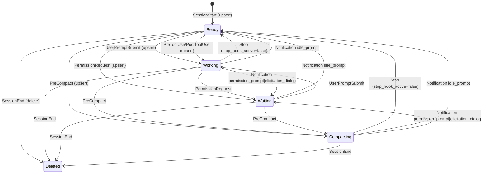
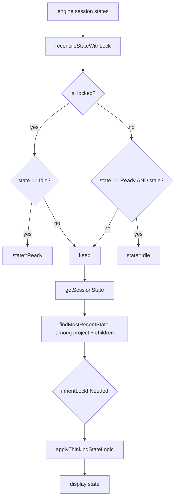

# State Detection Map (Current Behavior)

This document maps the current state detection and UI handling logic on the
`state-detection-v3` branch. It is intended to be a faithful snapshot of how
the system behaves today, not a proposal for changes.

Source modules:
- Hook writer: `scripts/hud-state-tracker.sh`
- Lock liveness and resolver: `core/hud-core/src/state/lock.rs`, `core/hud-core/src/state/resolver.rs`
- Session state synthesis: `core/hud-core/src/sessions.rs`
- Swift UI reconciliation: `apps/swift/Sources/ClaudeHUD/Models/SessionStateManager.swift`

## 1) Hook State Machine (state file writes)

Hook events map to session states in the state file. Some events only touch
metadata and do not change state.



Touch only (no state change, metadata only):
- Stop when stop_hook_active=true
- Notification (other types)
- SubagentStop
- Unknown events

Missing cwd handling:
- If an event would upsert but cwd is missing, the hook skips writing unless
  the session already exists in the state file.

## 2) Resolver: lock liveness + record selection

This resolves a single project path into a state by combining lock liveness
with the last known record.

```mermaid
flowchart TD
  A[project_path query] --> B{is_session_running?}
  B -- no --> Z[None]
  B -- yes --> C[find_matching_child_lock\n(exact or child; newest created timestamp)]
  C --> D[find_record_for_lock_path\nmatch cwd/project_dir; prefer fresh]
  D --> E{record?}
  E -- none --> F[state=Ready\nsession_id=None]
  E -- stale --> G[state=Ready\nsession_id=record]
  E -- fresh --> H[state=record.state\nsession_id=record]
```

Notes:
- Locks are verified by PID and proc_started.
- Legacy locks (no proc_started) expire after 24 hours.
- Parent locks do not make child active; child locks do make parent active.
- Lock "created" timestamps are normalized (seconds vs ms) before comparison.

## 3) Session detection (engine-side)

```mermaid
flowchart TD
  A[detect_session_state] --> B[resolve_state_with_details]
  B -- has lock --> C[record by session_id]
  C --> D{record stale?}
  D -- yes --> E[state=Ready, working_on=None]
  D -- no --> F[state=record.state]
  F --> G{busy + quiet transcript?}
  G -- yes --> H[state=Ready]
  G -- no --> I[state=as-is]
  I --> J[is_locked=true]

  B -- no lock --> K[recent_session_record_for_project? (TTL 120s)]
  K -- yes --> L[state=record.state]
  L --> M{busy + quiet transcript?}
  M -- yes --> N[state=Ready]
  M -- no --> O[state=as-is]
  O --> P[is_locked=false]

  K -- no --> Q{activity in project?}
  Q -- yes --> R[state=Working, is_locked=false]
  Q -- no --> S[state=Idle, is_locked=false]
```

Heuristics that can downshift Working/Compacting to Ready:
- Transcript has no recent writes (within a short TTL)
- There is no active subagent count
- The last event is not PreToolUse
- A lock exists but the session record is stale

## 4) Swift UI reconciliation and display selection



Thinking override:
- If thinking=true and not stale, force Working.
- If thinking is stale, clear it.
- If state=Working and not locked and thinking=false, downshift to Ready.

## 5) Known "Ready while busy" paths (current behavior)

These are the explicit paths that can yield Ready even when Claude is still
working:
- Transcript quiet heuristic (no recent writes) for busy states.
- Lock exists but the session record is stale.
- UI reconciliation can downshift stale Ready to Idle when not locked.

This document intentionally mirrors the current behavior for investigation and
debugging.

## 6) Truth tables (current behavior)

### Downshift predicate (busy -> Ready)

Used in `downshift_busy_if_transcript_quiet` for both lock and no-lock paths.

```text
Busy (Working/Compacting) | Transcript Quiet | Subagent Active | LastEvent=PreToolUse | Downshift to Ready
--------------------------|------------------|-----------------|----------------------|-------------------
0                         | X                | X               | X                    | 0
1                         | 0                | X               | X                    | 0
1                         | 1                | 1               | X                    | 0
1                         | 1                | 0               | 1                    | 0
1                         | 1                | 0               | 0                    | 1
```

### Engine output when lock exists

From `detect_session_state_with_storage` with `resolve_state_with_details`.

```text
Lock | Record | Record Stale | Busy | Downshift | Output State
-----|--------|--------------|------|-----------|------------------------------
Y    | N      | X            | X    | X         | Ready
Y    | Y      | Y            | X    | X         | Ready (working_on cleared)
Y    | Y      | N            | N    | X         | record.state (Ready/Waiting/Idle)
Y    | Y      | N            | Y    | Y         | Ready
Y    | Y      | N            | Y    | N         | record.state (Working/Compacting)
```

### Engine output when no lock exists

Recent record means: not parent-fallback and updated within 120s.

```text
Lock | Recent Record | Busy | Downshift | Recent Activity | Output State
-----|---------------|------|-----------|-----------------|---------------------------
N    | Y             | N    | X         | X               | record.state
N    | Y             | Y    | Y         | X               | Ready
N    | Y             | Y    | N         | X               | record.state (Working/Compacting)
N    | N             | X    | X         | Y               | Working
N    | N             | X    | X         | N               | Idle
```

### Swift UI reconciliation

From `SessionStateManager.reconcileStateWithLock`.

```text
is_locked | state | Ready-stale? | Output state
----------|-------|--------------|--------------
Y         | Idle  | X            | Ready
Y         | other | X            | unchanged
N         | Ready | Y            | Idle
N         | other | X            | unchanged
```

### Swift thinking override

Removed. The `thinking` field and UI override were excised as part of the
fetch-intercepting launcher deprecation.

## 7) Diagnostics (durable)

Hook event log:
- File: `~/.capacitor/hud-hook-events.jsonl` (JSONL, sanitized metadata only).
- Rotation: default 5 MB (override via `HUD_HOOK_LOG_MAX_BYTES`).
- Path override: `HUD_HOOK_LOG_FILE`.
- Captures: ts, session_id, event, action, state, cwd/project_dir, triggers, notification type,
  tool metadata, last-event metadata, and write status/skip reason (no prompt/tool IO bodies).

Snapshot script:
- Run: `scripts/state-snapshot.sh <project-path>`
- Output: `~/.capacitor/hud-state-snapshots/state-snapshot-<timestamp>-<path>.txt`
  (override via `HUD_STATE_SNAPSHOT_DIR`)
- Includes: matching `sessions.json` records, lock meta from `~/.claude/sessions`,
  transcript mtimes, and recent hook log entries.

## 8) Open questions (recorded for follow-up)

These questions capture intended behavior decisions. The list should be updated
as new context emerges.

1. What is the ground truth for “Claude is busy” (lock present, transcript writes, CLI running, tool in flight, other)?
2. For each state (`working`, `ready`, `waiting`, `compacting`, `idle`), what is the user-visible meaning and what should trigger it?
3. When a lock exists but the state record is stale, should we show `ready`, `working`, or something else?
4. When no lock exists, should we trust a recent record? If so, what TTL?
5. Should transcript quietness ever downshift `working/compacting` to `ready` while a lock exists? If yes, after how long?
6. During long tool calls with no transcript writes, should state remain `working`? How should we detect that?
7. How should subagents affect state? Is `active_subagent_count > 0` always “busy”?
8. What should `Stop` do when `stop_hook_active=true` (always touch, sometimes ready, never ready)?
9. For `Notification` events, which types should change state, and which should be metadata-only?
10. In multi-session scenarios under one project path, should we show the newest lock, the newest record, or aggregate?
11. For parent/child paths, should a parent show active if a child is active? Should a child ever inherit a parent?
12. How should we reconcile `project_dir` vs `cwd` when they differ? Which should be canonical for matching?
13. If an event omits `cwd`, should we infer from `CLAUDE_PROJECT_DIR`/`transcript_path`, or skip the event?
14. Should `state_changed_at` reflect only hook transitions, or also derived changes (like downshifts)?
15. What are the desired staleness thresholds for record freshness without a lock, UI “ready” staleness, and transcript quietness?
16. Should file activity (no lock) be allowed to force `working`? For how long, and should it override `ready/idle`?
17. Should `waiting` ever expire to `ready/idle` if no new events arrive?
18. If `SessionEnd` is missing (crash/kill), what should the fallback behavior be?
19. Should `thinking` remain reserved/disabled (always `nil`) or be wired to a real-time signal?
   - Resolved: removed from the Rust/Swift API when excising the deprecated fetch-intercepting launcher code.
