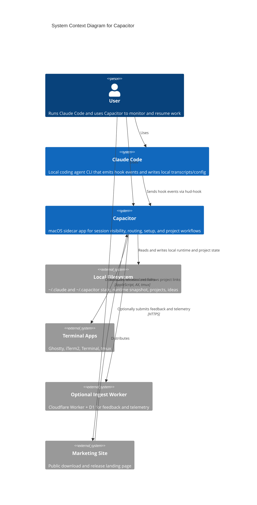

# System Context Diagram

```mermaid
C4Context
  title System Context Diagram for Capacitor

  Person(user, "User", "Runs Claude Code and uses Capacitor to monitor and resume work")

  System(claude, "Claude Code", "Local coding agent CLI that emits hook events and writes local transcripts/config")
  System(capacitor, "Capacitor", "macOS sidecar app for session visibility, routing, setup, and project workflows")
  System_Ext(fs, "Local Filesystem", "~/.claude and ~/.capacitor state, runtime snapshot, projects, ideas")
  System_Ext(ghostty, "Terminal Apps", "Ghostty, iTerm2, Terminal, tmux")
  System_Ext(ingest, "Optional Ingest Worker", "Cloudflare Worker + D1 for feedback and telemetry")
  System_Ext(site, "Marketing Site", "Public download and release landing page")

  Rel(user, capacitor, "Uses")
  Rel(user, claude, "Uses")
  Rel(claude, capacitor, "Sends hook events via hud-hook")
  Rel(capacitor, fs, "Reads and writes local runtime and project state")
  Rel(capacitor, ghostty, "Activates terminal sessions", "AppleScript, AX, tmux")
  Rel(capacitor, ingest, "Optionally submits feedback and telemetry", "HTTPS")
  Rel(user, site, "Downloads releases and follows project links")
  Rel(site, capacitor, "Distributes")
```

Notes:

- The optional ingest worker is outside the core runtime truth boundary.
- The marketing site is a separate system-level surface, not a runtime container.
