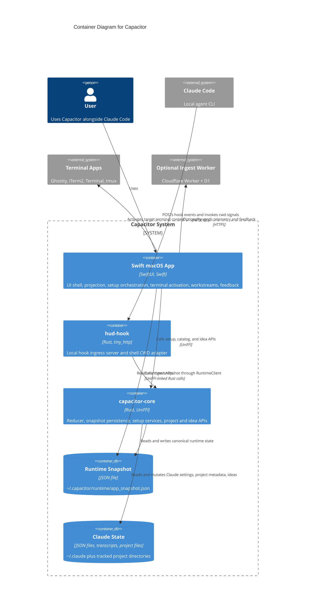

# Container Diagram

Container observations:

- The actual architecture is closer to a file-backed, local-first sidecar than a daemon/client model.
- `capacitor-core` is currently overloaded: it is both runtime engine and a broad service façade.
