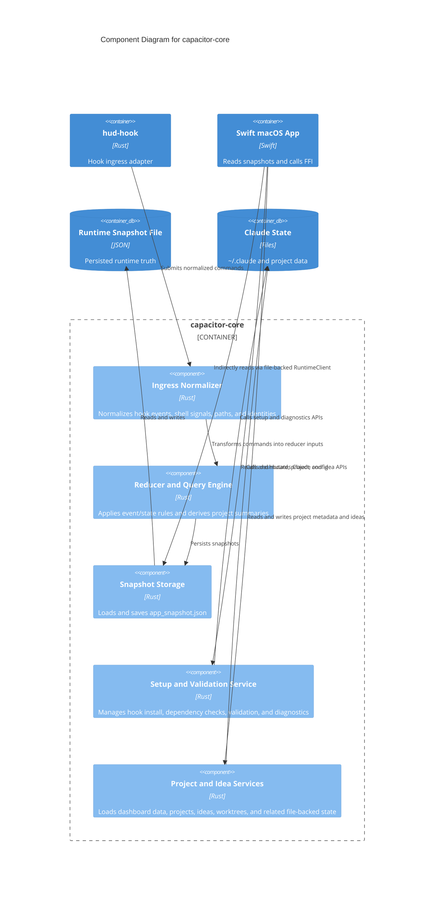

# Core Runtime Component Diagram

Component observations:

- The reducer path is reasonably coherent and well-tested.
- The FFI surface does not preserve this clean split. `CoreRuntime` currently exposes runtime, setup, project catalog, and idea concerns as one object.
