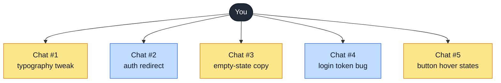
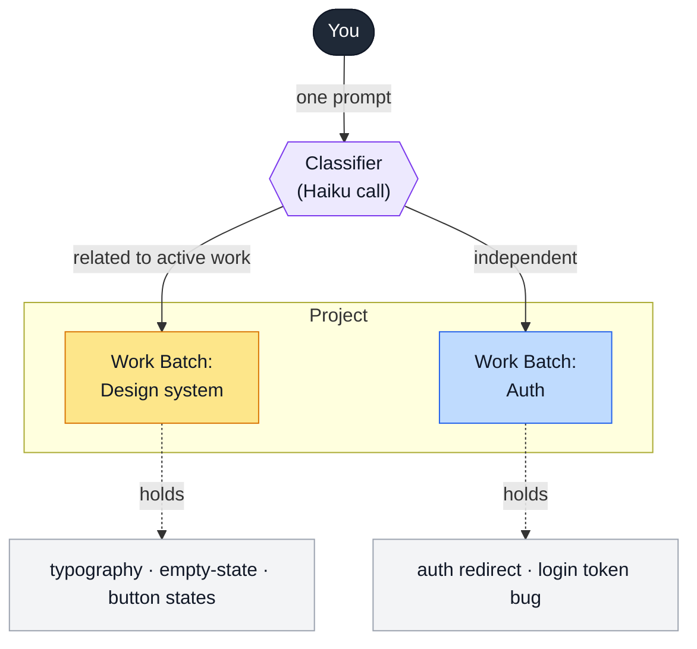
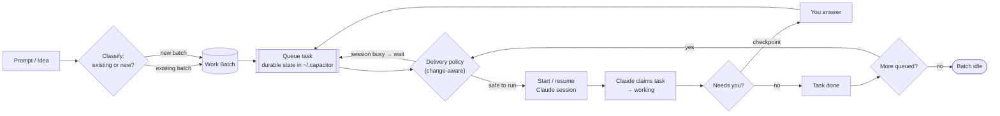
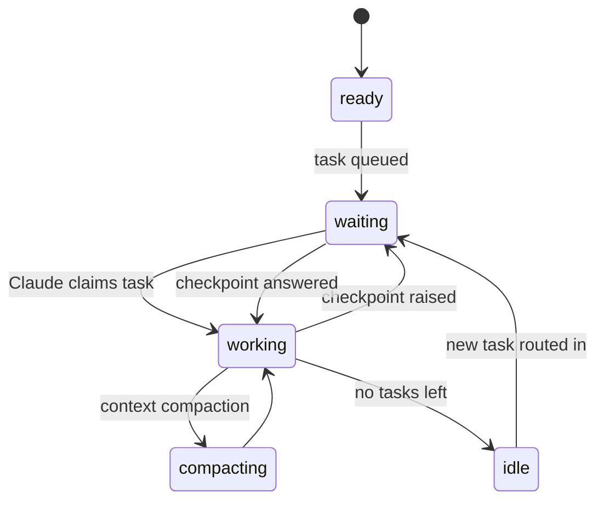

# Work Batch Model — Diagram

Status: explainer
Audience: anyone (product, docs, new contributors)
Scope: the mental model behind Capacitor's batch-first home — why it replaces "one chat per thing"
Date: 2026-05-28

## The shift in one sentence

Instead of opening a **new chat for every thing you're working on** (fan-out — you hold all
the context-switching in your head), you **send a prompt to a project** and Capacitor
**automatically batches it with related work** (fan-in — the grouping happens for you).

---

## Before vs. After

### Before — one chat per thing (fan-out)

You start a separate session for each intent. Related work (same color below) ends up
scattered across windows, and *you* are the only thing holding the grouping together.

> N intents → N windows. The two design-system chats and the two auth chats are obviously
> related, but nothing in the system knows that — you re-establish context each time you switch.

### After — one prompt, auto-batched (fan-in)

You send a prompt to a project. A lightweight classifier decides whether it belongs to an
**active batch** or deserves a **new** one, and routes it there. The grouping is now data,
not something you carry.

> Same five intents, but they collapse into **two batches**. Adding "button hover states"
> later doesn't open a sixth window — it lands in the existing Design-system batch.

---

## How it actually works — lifecycle of a task

The mechanism behind the fan-in. The important subtlety: a task is **queued durably first**,
and a separate **change-aware delivery policy** decides *when* it's safe to start or resume a
Claude session — so routing a related task into a busy batch never interrupts the running work.

### Batch status, as a state machine

What the batch row shows you at a glance. Mirrors session state so the home view reads like
a status board.

---

## Terminology

| Term | What it is |
|------|------------|
| **Project** | Top-level workspace; contains one or more Work Batches. |
| **Work Batch** | A named container for related tasks that share one Claude session/context. |
| **Task** | One unit of work. Status: `queued → working → done` (or `needs_you` at a checkpoint). |
| **Classifier** | A Haiku call that routes a new prompt to an existing batch or a new one, by semantic relatedness. |
| **Queue** | Durable task list persisted in `~/.capacitor/.../work-batches/state.json` — written *before* any session starts. |
| **Delivery policy** | Change-aware decision: `queueOnly` (busy), `startNewSession`, `resumeExistingSession`, or `waitForCheckpoint`. |
| **Checkpoint** | A gate where Claude needs your input; surfaces as a `waiting` batch and is the primary action. |
| **Context mirror** | `.capacitor/work-batch-context.md` written into the worktree so the agent can read the full batch. |

## Source of truth

- Routing & classification — `apps/swift/Sources/Capacitor/Models/WorkBatchClassifier.swift`, `WorkBatchAutoRouter.swift`
- State & types — `apps/swift/Sources/Capacitor/Models/WorkBatchState.swift`
- Delivery — `docs/circuit/work-batch-task-delivery-implementation-spec.md`, `work-batch-task-delivery-policy.md`
- In-session task requests — `docs/circuit/work-batch-in-session-task-request-spec.md`
